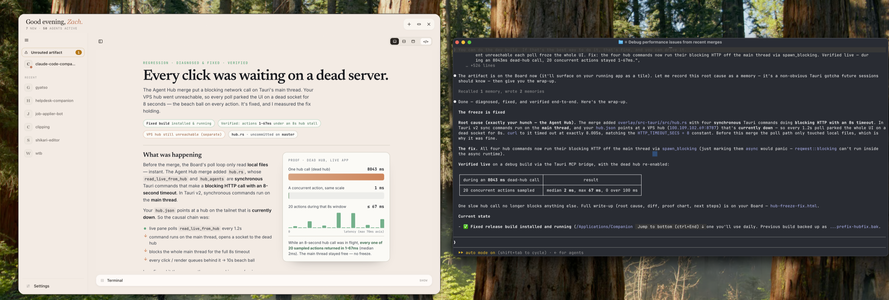

# Claude Code Companion

**The desktop app where your coding agents show you what they're doing — and ask you what's next. Read each turn in seconds, answer with a click, and keep as many agents moving as you want.**

[](https://github.com/mrgyatso/claude-code-companion/releases)
[](#requirements)
[](#first-launch)
[](https://github.com/mrgyatso/claude-code-companion/releases)

Your agent keeps doing more on its own. In a terminal, that arrives as a wall of scrollback you skim past — and you drift out of the loop. Companion turns every turn into a page you actually read: the plan, the diff, the call it needs from you, laid out to digest at a glance. And it doesn't only show you — it **asks**. Each page ends in the agent's open questions as one-click **✓ / ✎ / ✗** answers that go straight back to it. You move the work forward from the app, and for a lot of turns you never open the terminal at all.

Run one agent or ten — local, or running on a box across the world. They all land on one surface, and each one tells you the moment it needs you, so you switch between them in seconds.

## Demo



*A real session: Claude tracked down a UI freeze, and Companion rendered its write-up — root cause, a proof chart, and a one-click decision — as a page you read and answer without touching the terminal.*

<!--
  To add the demo video:
    1. Open a new GitHub issue (or edit the latest release) and drag your .mp4/.mov in.
    2. GitHub uploads it and returns a https://github.com/user-attachments/assets/… URL.
    3. Paste that URL on its own line below (plain, no image markdown; GitHub embeds a player).
-->

> Demo video coming soon.

## Why it reads so well

This builds on Anthropic's ["The unreasonable effectiveness of HTML"](https://claude.com/blog/using-claude-code-the-unreasonable-effectiveness-of-html) by Thariq Shihipar ([@trq212](https://x.com/trq212)). The idea: an agent that reports its plans, reviews, and decisions as rich, interactive HTML — tables, diagrams, charts, live controls — instead of walls of Markdown keeps your review loop tight. *"You stay in the loop, but the loop gets much tighter."*

Your agent writes each turn as one of those HTML pages. Companion watches for it and renders it the instant it's written — no file to open, no window to switch to. That's why a turn you'd have skimmed past in scrollback becomes something you read, react to, and answer in place.

## What you do here

- **Read, don't scroll.** Every turn is a page built to digest at a glance — the plan, the diff, the call to make — instead of scrollback you skim past.
- **Answer in the UI.** The agent's open questions and decisions become **✓ do it / ✎ note / ✗ skip** you click; your answer lands straight back with the agent. For decision and question turns, you never touch the terminal.
- **Run the agents themselves.** Start Claude sessions right in the app and type into them whenever you want. They survive restarts and resume where they left off.
- **One home for every agent.** Sessions group by project — two agents in one repo read as a single card — and the home orders them by who needs a decision, so you always know where to look next.
- **Reach agents anywhere.** Connect remote or offsite agents through the optional hub; they appear on the same surface and you answer them the same way.
- **Peek the code.** See the files a session is touching, in a real editor, without leaving the app.
- **Stays out of your way.** It never steals keyboard focus — when you *do* drop to the terminal, it's right beside you.

## Requirements

macOS 11 or later. The release is a universal build that runs natively on both Apple Silicon and Intel. Building from source needs Rust and Node 18+.

## Install

### Homebrew (recommended)

```bash
brew install --cask mrgyatso/tap/claude-code-companion
```

This installs the app to `/Applications`, symlinks the `companion` CLI onto your PATH, and clears the macOS quarantine flag for you. Then confirm everything is wired:

```bash
companion doctor
```

### Manual

1. Download the latest `.dmg` from the [Releases page](https://github.com/mrgyatso/claude-code-companion/releases).
2. Open it and drag Companion Overlay into Applications.
3. Approve it on first launch (see below).
4. Link the `companion` CLI (shipped inside the app):
   ```bash
   ln -sf "/Applications/Companion Overlay.app/Contents/Resources/scripts/companion" /usr/local/bin/companion
   ```

## First launch

> Homebrew users can skip this — the cask clears the quarantine flag on install.

The build isn't signed yet, so macOS will block a manual install the first time ("Companion Overlay can't be opened because Apple cannot check it for malicious software"). Right-click the app in Applications, choose Open, then Open again. If that doesn't work, clear the quarantine flag:

```bash
xattr -dr com.apple.quarantine "/Applications/Companion Overlay.app"
```

You only do this once. A signed build will follow.

## Using it

Bring the app forward:

```bash
companion board
```

You land on your home — every live session and connected agent, ordered by who needs a decision. Open one to read its latest page, answer its questions right there, and drop back. Start a new session from the home and it runs inside the app; type into its terminal whenever you want to.

The app also runs quietly in the menu bar. Its icon shows how many agents need you, and a click gives you the same roster at a glance.

Shortcuts:

- `⌘0` — show or hide the app
- `⌘8` — the history of past pages

## Making it automatic (the plugin)

The point is that you don't render anything by hand — the agent does, as it works. Install the Claude Code plugin and that wiring lands automatically. In Claude Code:

```
> /plugin marketplace add mrgyatso/claude-code-companion
> /plugin install companion@claude-code-companion
```

That gives you:

- lifecycle hooks that turn the working agent into the author of these pages — every substantive turn can surface one, with its state and open questions,
- a `prefer-html` skill that shapes those pages (and ends each one in a decision surface you can answer),
- slash commands:
  - `/companion:html` — render a page for the current turn on demand.
  - `/companion:mode selective|always|manual` — how eagerly pages are generated. **selective** (default) renders when a turn is worth it; **always** renders on every substantive turn; **manual** renders nothing until you ask with `/companion:html`.
  - `/companion:quality fast|pretty` — **fast** (default) builds pages locally with no model call and no cost; **pretty** brings in a model for sharper design on genuinely visual turns.
  - `/companion:doctor` — a health panel, rendered through the same path it verifies.
  - `/companion:example` — an onboarding page that explains the app.

`/companion:render` is the deprecated alias of `/companion:html` and works for one release.

The watched folder defaults to `~/.claude/companion/artifacts` (override with `COMPANION_ARTIFACTS_DIR`).

### External terminals (off by default)

The plugin only acts in terminals the **app itself spawns** (they carry a `COMPANION_SESSION` marker). A plain terminal that merely has the plugin installed — an "external" terminal — is **ignored by default**: it never joins the home, never has its pages indexed, and never spins up the background generator. This keeps sessions that aren't using the app from cluttering it.

To opt a machine into external-terminal handling, write `on` to the flag file:

```bash
echo on > ~/.claude/companion/external-terminals   # re-enable
rm ~/.claude/companion/external-terminals           # back to off (default)
```

(Remote agents that push pages through the hub are a separate path and are unaffected by this setting.)

### Wiring it by hand

If you'd rather not use the plugin, add a `PostToolUse` hook in `~/.claude/settings.json`:

```json
{
  "hooks": {
    "PostToolUse": [
      {
        "matcher": "Write|Edit",
        "hooks": [
          { "type": "command", "command": "/Applications/Companion Overlay.app/Contents/Resources/scripts/companion-hook" }
        ]
      }
    ]
  }
}
```

The watched folder defaults to `~/.claude/companion/artifacts` (override with `COMPANION_ARTIFACTS_DIR`).

## Build from source

It's a Tauri v2 (Rust) app with a vanilla TypeScript frontend.

```bash
git clone https://github.com/mrgyatso/claude-code-companion.git
cd claude-code-companion/overlay
npm install
npm run tauri build -- --bundles app
cp -R "src-tauri/target/release/bundle/macos/Companion Overlay.app" ~/Applications/
ln -sf "$PWD/scripts/companion" /usr/local/bin/companion
```

Use `--bundles dmg` to produce a distributable `.dmg` instead. Add `--target universal-apple-darwin` (with both `rustup target add aarch64-apple-darwin x86_64-apple-darwin`) to build the universal binary that ships in releases.

## Roadmap

- Signing and notarization, to remove the Gatekeeper warning.
- Editing code inline in the peek panel, not just reading it.
- Answering more of the loop from the UI, so the terminal becomes optional even more of the time.

## Credit and license

The idea comes from Thariq Shihipar's ["The unreasonable effectiveness of HTML"](https://claude.com/blog/using-claude-code-the-unreasonable-effectiveness-of-html) ([@trq212](https://x.com/trq212)). This project is the surface that makes that workflow effortless.

Licensed under the [MIT License](./LICENSE).
